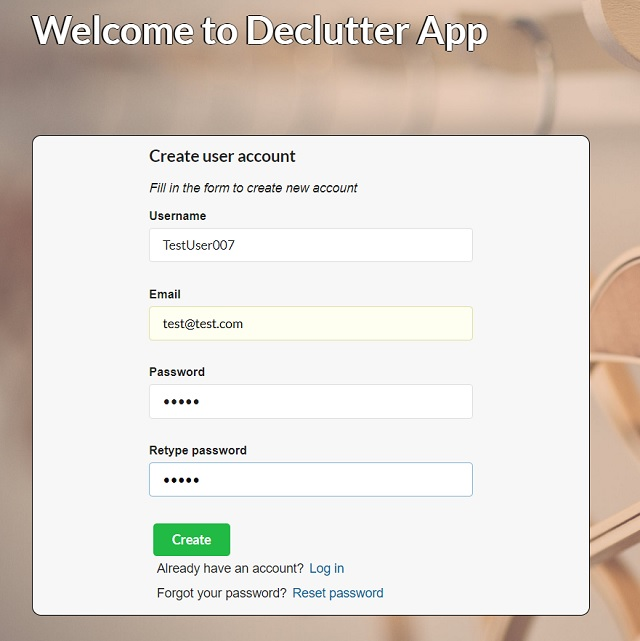
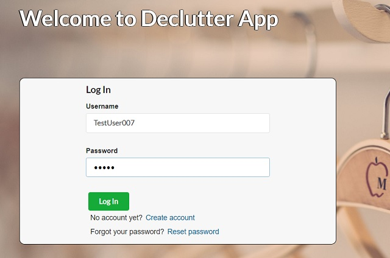
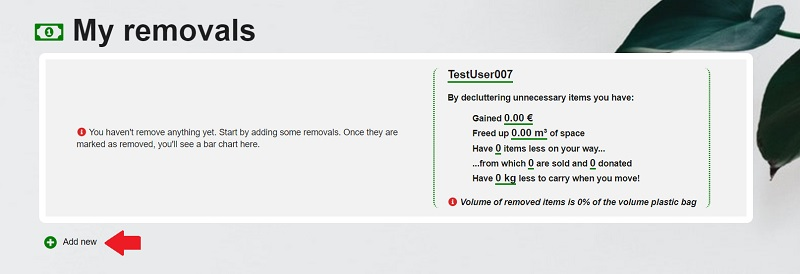
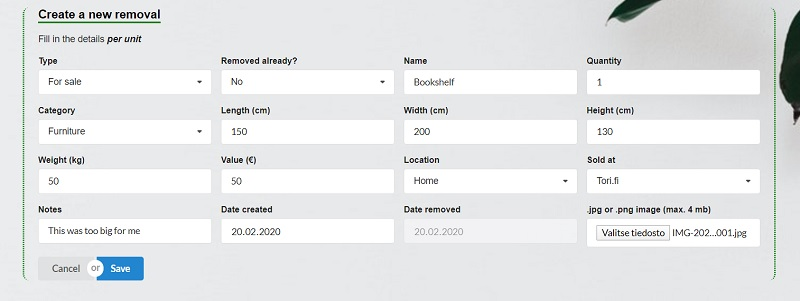
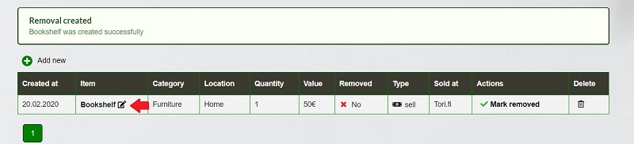
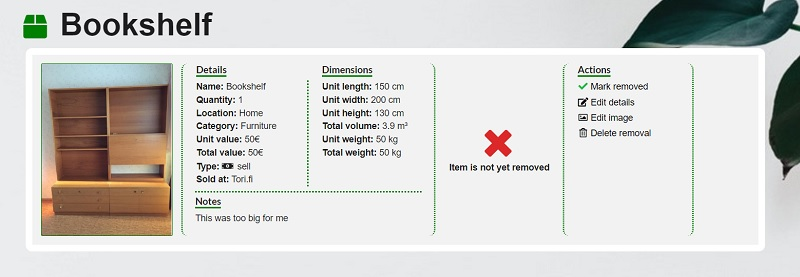
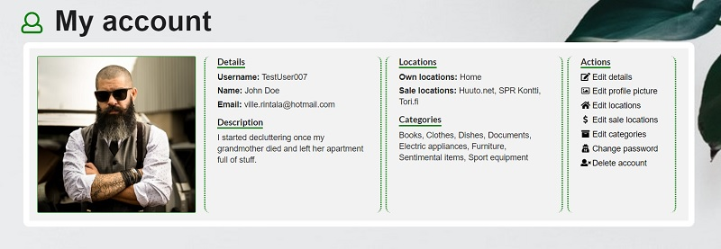
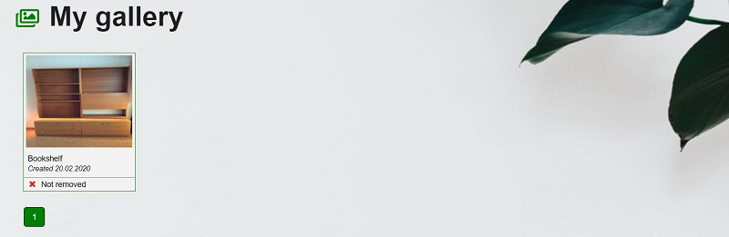

# Declutter App instructions 

## What is Declutter App?

This app helps you to keep track of unnecassary items which you have sold or donated - or are planning to do so. 
App gives you an overview of how much you have earned and how much you have freed up space thanks to decluttering. 
All in all, its purpose is to encourage to let go of the things you don't need, share them and stay organized at the same.

## How to use it?

Using Declutter App is simple and pretty self-explanatory once you get started. Here are some basic steps to begin with:

#### In the beginning 

### Create an account

First you need to create an account by entering your details. Landing page is login page but by clicking *Create account* 
link you will see another form:

    

After filling your details click *Create* and confirmation email will be send to the email address you provided. Link contains confirmation link which you need to click in order to confirm your account and start using Declutter App.

*If you didn't receive confirmation email, check your junk mail folder also.*

### Log in

Once you click the confirmation link in email you will be redirected to log in page:

    

Type your username and password, click *Log In* and you will be redirected to the main (removals) page ->

#### Main page (removals page)

On the main page you can add new removals and see an overview of all your removals

### Create removal

You can create new removal by clicking *Add new* button which will open a form.

    

The form looks like this:

    

*What all the fields are?*

* Type: Is the item for sale or donation

* Removed already: Is the item already removed (sold or donated)

* Name: Name of the item

* Quantity: How many of those items

* Category: What is the suitable category for the item

* Length: *Unit* length of one item

* Width: *Unit* width of one item

* Height: *Unit* height of one item

* Weight: *Unit* weight of one item

* Value: *Unit* value of one item

* Location: From where the item is removed

* Sold at: Where the item is sold or donated

* Notes: Additional notes about the item

* Date create: When the item is published for sale or donation for example in online secondhand store

* Date removed: When the item was sold or donated (disabled if not removed yet)

* Image: Image of the item

*IMPORTANT!* 

As length, width, height, weight and value refer to *unit* measurements it is important to note that these values are used later to calculate total volume, total weight
and total value of one removal. One removal can consist of multiple items. Creation works well with similar items. 

Let's say you have 12 similar size encyplopedia books and you put their unit measurements, weights and prices in the form. Once the form is submitted dimensions are multiplied by 12 to get the total volume for one
*removal*. Same will be done with weight and value. In summary page 12 items are taken in consideration. So one removal consists of 12 items.

If you have items which are not similar in size, such as bunch of old clothes, you can treat this as one removal with a name, for example, "bunch of old clothes" and give it quantity of 1 and measurements and value of that whole bunch. This is the best practise with this type of items. In summary page 1 item is taken in consideration because removal was treated in one bunch. So one removal consists of one item (the bunch of old clothes).

#### Individual removal page 

Once the removal is created it will appear in the table on the main page. There is a small edit icon next to the removal name and by clicking that you will be redirected to that removal's page. You can also search for removals by using search bar in header and click removal name to navigate into that removal's page.

    

Removal page looks like this:

    

Page consists of details of the removal and actions related to that.

*What all the actions are?*

* Mark removed: This is either *Mark removed* or *Mark not removed* depending on the removal type. By clicking this you can mark the item removed / not removed. Additional details about the final value and removal date will be asked upon clicking

* Edit details: Here you can edit all the details (name, value etc.) of the removal

* Edit image: Here you can add, change or delete image of the removal

* Delete removal: This action will delete the removal and redirect back to the main page

#### Account page

On the account page you can see and edit all your personal details which will be also reflected to removals you create.

*This example has already prefilled details:*

    

Page consists of details and actions related to your account.

*What all the actions are?*

* Edit details: Here you can edit username, name, email and description

* Edit profile picture: Here you can add, change or delete your profile picture

* Edit locations: Here you can add or delete locations. These are the locations which you are decluttering

* Edit sale locations: Here you can add or delete sale locations. These are the locations where you sell or donate your items. For example online secondhand stores

* Edit categories: Here you can add or delete categories of removals

* Change password: Here you can change your password

* Delete account: Here you can delete your account

#### Gallery page

Gallery page shows all your removals on the same page in a form of a product card. If you ever want to a have quick glimpse of all the stuff you have removed, gallery page works for that. Cards are sorted by creation date and the latest will be shown first.

Gallery page looks like this:

    

By clicking the card you will be redirected to that removal's page.

**That's it! As you may have noticed by now, using Declutter App is simple. Happy decluttering!**

